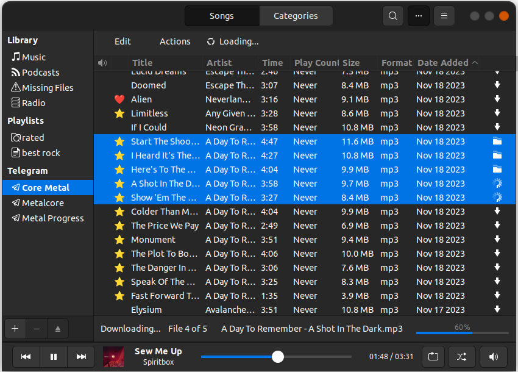

# Rhythmbox Telegram Music Plugin

Rhythmbox-Telegram is a plugin for Rhythmbox that allows you to listen to and download music from Telegram directly within Rhythmbox.


[**More screenshots here**](screenshots)

## Key Features

- **Telegram Integration**: Easily add Telegram channels/groups/chats to Rhythmbox as playlists, simplifying your music browsing experience.

- **Browse Audio Files**: Easily browse, search, and organize audio files shared in Telegram directly from Rhythmbox, ensuring quick and convenient access to your favorite tracks.

- **Listen to Music**: Enjoy audio content from Telegram directly in Rhythmbox, allowing continuous music playback without switching between applications.

- **Download to Library**: Download audio files from Telegram directly to your Rhythmbox library, expanding your music collection with the content you enjoy.

With Rhythmbox-Telegram, enjoy the convenience of accessing and downloading your favorite Telegram audio content into your music library, transforming how you organize and enjoy your music collection.

## Installation

**Note:** Regardless of the installation method, the plugin depends on TDLib. For architectures other than x64, TDLib must be installed manually.  Refer to the official [TDLib GitHub repository](https://github.com/tdlib/td) for instructions. TDLib for x64 is installed automatically.

### Method 1: Install from Debian Package

For Debian-like systems, download the latest `.deb` package from the [releases page](https://github.com/mervick/rhythmbox-telegram/releases). Then install it using the following command:

```sh
sudo dpkg -i rhythmbox-telegram-plugin_*.deb
```

If the architecture is different from x64, you can still use the Debian package, but you will need to [install TDLib manually](https://github.com/tdlib/td).

---

### Method 2: Install Using the Installation Script

Run the `install.sh` script from the repository:

```sh
git clone https://github.com/mervick/rhythmbox-telegram
bash rhythmbox-telegram/install.sh
   ```

The script will handle the entire installation process, including downloading dependencies, setting up the plugin, and compiling schemas.

If the architecture is different from x64, you will need to [install TDLib manually](https://github.com/tdlib/td).

---

### Method 3: Manual Installation

Download the plugin from the repository, install required pip3 libs, copy plugin files to the Rhythmbox plugins folder, then compile GLib schemas:

```sh
# clone plugin gi
git clone https://github.com/mervick/rhythmbox-telegram
# install required python libs
pip3 install -r "rhythmbox-telegram/requirements.txt" -t "rhythmbox-telegram/lib"
# create plugin dir
mkdir -p ~/.local/share/rhythmbox/plugins/rhythmbox-telegram/
# copy plugin files
cp -r rhythmbox-telegram/* ~/.local/share/rhythmbox/plugins/rhythmbox-telegram
# copy plugin glib schema
sudo cp rhythmbox-telegram/org.gnome.rhythmbox.plugins.telegram.gschema.xml /usr/share/glib-2.0/schemas/
# update glib schema
sudo glib-compile-schemas /usr/share/glib-2.0/schemas/
```

### Restart Rhythmbox

After installing the plugin, if Rhythmbox is open, restart it.

## Activation

After installing the plugin, you need to:
- Activate it in the Rhythmbox settings 
- Obtain a Telegram API ID 
- Authenticate the Telegram user

### Obtaining Telegram API ID

In order to obtain an API id you need to do the following:

- Log in to your Telegram core: https://my.telegram.org.
- Go to [API development tools](https://my.telegram.org/apps) and fill out the form.
- You will get `api_id` and `api_hash` parameters required for user authorization.

More detailed instructions can be found in the [Telegram documentation](https://core.telegram.org/api/obtaining_api_id)

### Authorization

After obtaining the API ID, in the plugin settings, input the received `api_id` and `api_hash`, along with your Telegram user's phone number. Then, press the 'Connect' button. Telegram will send you a code for authorization to any connected Telegram app.

### Adding your music to Rhythmbox

After successfully connecting Telegram to Rhythmbox, in the plugin settings, you'll be able to add Telegram chats to listen to your favorite music.

## Telegram API Usage

The plugin uses the Telegram API strictly for reading purposes.  
**No write operations are performed**.  

The following actions are carried out:

* Authorization process
* Retrieving the chats list
* Iterating over all messages in chats selected as "Music Sources" in the plugin settings (only audio files are searched)
* Downloading of audio files
* Getting a public link to a message with an audio file

No other operations are conducted.

### Full list of API methods and handlers that the plugin uses:

* `setTdlibParameters` - Sets the parameters for TDLib initialization
* `checkDatabaseEncryptionKey` - Checks the database encryption key for correctness
* `getAuthorizationState` - Gets the current authorization state
* `setAuthenticationPhoneNumber` - Sets the phone number of the user and sends an authentication code to the user
* `checkAuthenticationPassword` - Checks the 2-step verification password for correctness
* `checkAuthenticationCode` - Checks the authentication code
* `getChats` - Gets an ordered list of chats from the beginning of a chat list
* `loadChats` - Loads more chats from a chat list
* `getChat` - Gets information about a chat by its identifier
* `getChatHistory` - Gets messages in a chat
* `getMessage` - Gets information about a message
* `downloadFile` - Downloads a file from the cloud
* `getMessageLink` - Gets an HTTPS link to a message in a chat
* `updateAuthorizationState` - Listens the user authorization state
* `updateNewChat` -  Listens when a chat is loaded or created


### Audio Loading and Data Retrieving

The audio file list is fetched in small batches with a 20-second interval (the first few pages are loaded with a 5-second interval) to stay within API quota limits. To ensure a low number of requests, the plugin retrieves the list of files from chats once. Once the playlist is completely loaded, the system checks for new messages every 2 minutes.
The plugin caches information about retrieved audio files.  
This approach ensures efficient, quota-compliant, and timely updates of new content.  

### Authentication Data

Authentication data is encrypted and stored within the GNOME Keyring. This ensures that it is securely protected within the GNOME environment.

### Telegram Data

Data obtained from Telegram is encrypted using a user-provided encryption key and managed by the official Telegram client [TDLib](https://core.telegram.org/tdlib).  
The encrypted database is stored at `~/.local/share/rhythmbox/telegram/*/database`  
This database is required for TDLib to work.

### Temporary Audio Files

Temporary audio files are stored at `~/.local/share/rhythmbox/telegram/*/files/music`  
You can delete these files at any time.  
You can also delete these files through the plugin settings.

### Audio Metadata

We store audio file metadata in a plain SQLite database.  
This includes: chat identifier, message ID of the audio file within the chat, publication date/time, file size, file name, and audio metadata tags.  
Additionally, it stores information about loaded chats as segments of message ID ranges, as well as details on hidden and downloaded audio files within the playlist.  

This database is located at: `~/.local/share/rhythmbox/telegram/*/data.sqlite`

Data is loaded  once for each chat. If you delete this database, the information will have to be fetched again.


## Contribute

If you like our plugin, you can support Rhythmbox-Telegram by spreading the word about the plugin and don’t forget to give a star to the repository on GitHub.

