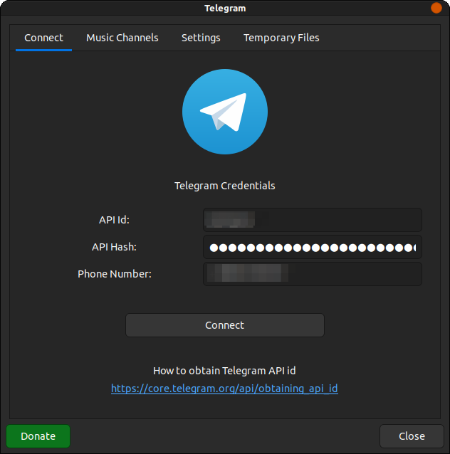
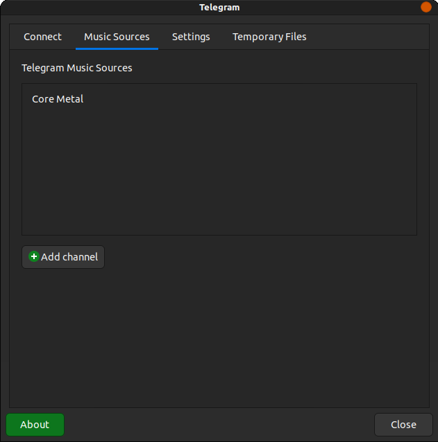
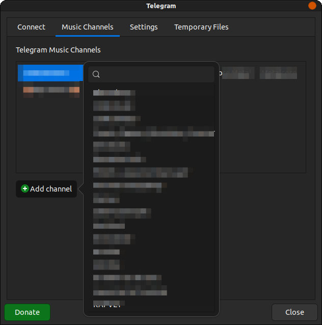
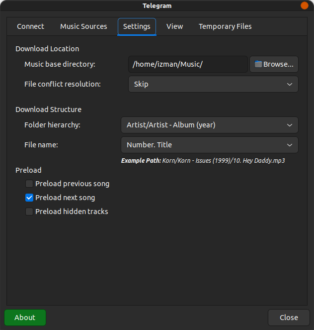
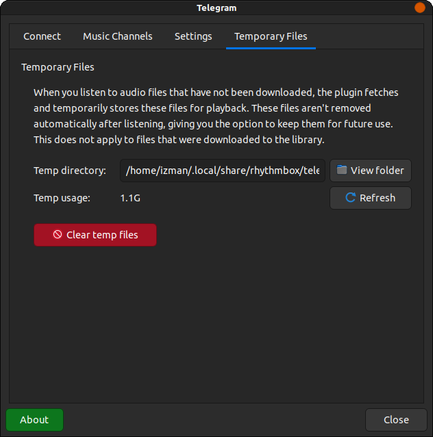

## Rhythmbox-Telegram Settings Screenshots

[//]: # (![Telegram playlist in Rhythmbox]&#40;screenshots/playlist.png&#41;)
[//]: # (![Telegram Authorization - Entering code]&#40;screenshots/code.png&#41;)

